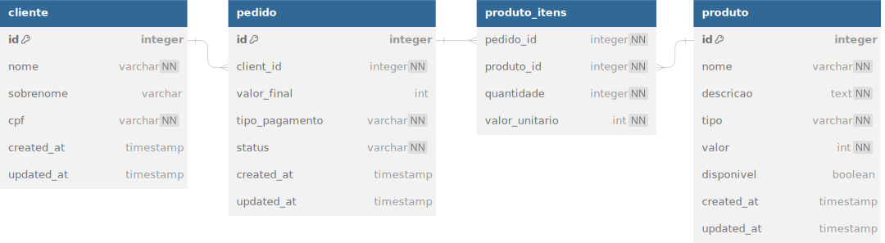

# Lanchonete
Projeto relacionado a especialização em Arquitetura de Software na FIAP

## Documentação

- [Event Storming](https://miro.com/app/board/uXjVMhCtq7A=/?share_link_id=4017855910)
- [Glossário de Linguagem Ubíqua](https://github.com/teamG11/lanchonete/blob/main/docs/linguagem-ubiqua.md)
- [Estruturação do banco de dados](https://github.com/teamG11/lanchonete/blob/main/docs/database.md)

## Código do projeto

- [Github](https://github.com/teamG11/lanchonete)

## Estruturação do banco de dados


## Quick-start
Para inicializar o projeto em ambiente local siga os seguintes passos

1. Realizar a instalação das dependências:
    - [docker](https://docs.docker.com/engine/install/)
    - [postman](https://www.postman.com/downloads/)
2. Executar o projeto
```sh
docker compose up --build --force-recreate
```
3. Importar os exemplos de requests para o Postman
    - [collection](tooling/postman/lanchonete.postman_collection.json)
4. Executar as requests via Postman seguindo a ordem numérica
5. Acessar na url `localhost:8082` o SWAGGER com a documentação dos endpoints da API.

## Build
Para realizar o build e o push da [imagem de produção](https://hub.docker.com/repository/docker/leoeareis/lanchonete-app/general) siga os seguintes passos

1. Executar `docker build --no-cache -f Dockerfile --target production -t leoeareis/lanchonete-app:<INCREMENTAR ULTIMA VERSAO DO DOCKER HUB> .`
2. Executar `docker push leoeareis/lanchonete-app:<INCREMENTAR ULTIMA VERSAO DO DOCKER HUB>`
3. Executar `docker build --no-cache -f Dockerfile --target production -t leoeareis/lanchonete-app:latest .`
4. Executar `docker push leoeareis/lanchonete-app:latest`

## Deployment

- Seguir o passo a passo presente no em [/deployments/README.md](https://github.com/teamG11/lanchonete/tree/main/deployments) 